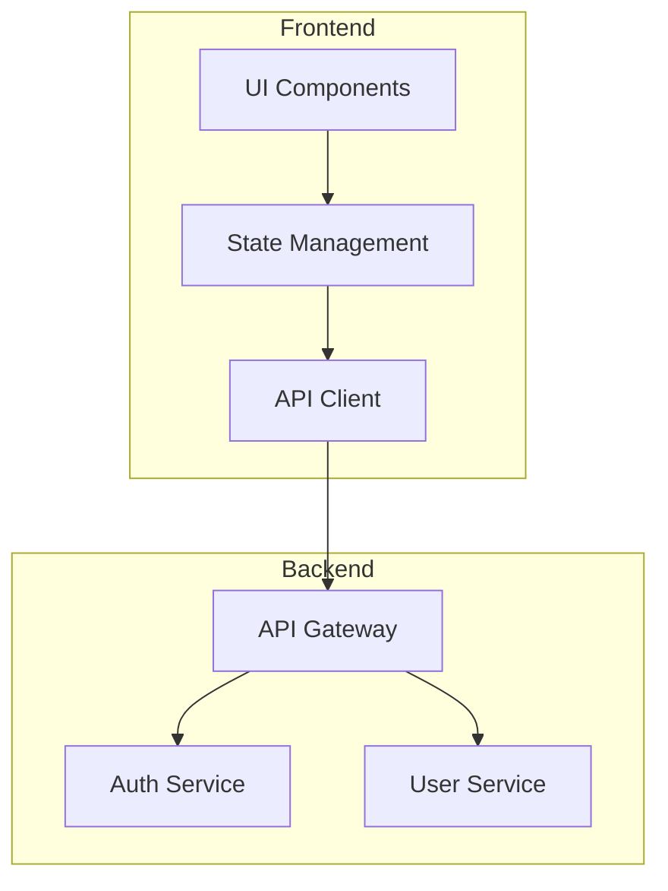

# Yantra - Product Specifications

**Document Status**: Living Specification  
**Last Updated**: November 25, 2025  
**Purpose**: Detailed requirements and specifications for features to be implemented

---

## Table of Contents
1. [Architecture View System](#architecture-view-system)
2. [Future Features](#future-features)

---

## Architecture View System

### Overview
A comprehensive architecture visualization and governance system that enables design-first development, automatic architecture generation from existing code, and bidirectional sync between conceptual architecture and implementation.

**Key Principle**: Architecture is the source of truth. Code must align with architecture, not vice versa.

---

### 1. Core Capabilities

#### 1.1 Architecture Lifecycle

**Pre-Code Phase (Design First)**
- User describes intent via chat: "Build a REST API with JWT authentication and Redis caching"
- AI generates conceptual architecture diagram with components and connections
- User reviews and iterates on architecture before any code is written
- Architecture becomes the contract for implementation

**Implementation Phase**
- AI generates code based on approved architecture
- Files automatically link to architecture components
- Components show implementation status (0/5 files, 3/5 files, 5/5 files ✓)
- User can expand components to see linked files (hidden by default)

**Evolution Phase**
- User modifies architecture → AI assesses code impact → User approves changes → AI refactors code
- User modifies code → AI detects misalignment → User chooses: update architecture or revert code
- Continuous alignment checking ensures architecture and code stay in sync

**Import/Clone Phase**
- When importing existing project from GitHub or folder
- AI automatically analyzes codebase using GNN
- Generates conceptual architecture from code structure
- User reviews and refines auto-generated architecture
- Architecture becomes governance layer for future changes

---

### 2. Storage Architecture

#### 2.1 Hybrid Storage Strategy

**Primary Storage: SQLite Database** (`.yantra/architecture.db`)

**Purpose**: Authoritative, ACID-compliant, queryable storage

**Schema**:
```sql
CREATE TABLE components (
    id TEXT PRIMARY KEY,
    name TEXT NOT NULL,
    type TEXT NOT NULL,  -- 'service', 'module', 'layer', 'database', 'external', 'ui_component'
    description TEXT,
    position_x REAL,
    position_y REAL,
    width REAL DEFAULT 200,
    height REAL DEFAULT 100,
    parent_id TEXT,  -- For hierarchical grouping
    layer TEXT,  -- 'frontend', 'backend', 'database', 'external', 'infrastructure'
    metadata_json TEXT,  -- Flexible storage for custom properties
    created_at TIMESTAMP DEFAULT CURRENT_TIMESTAMP,
    updated_at TIMESTAMP DEFAULT CURRENT_TIMESTAMP,
    FOREIGN KEY (parent_id) REFERENCES components(id) ON DELETE CASCADE
);

CREATE TABLE connections (
    id TEXT PRIMARY KEY,
    from_component_id TEXT NOT NULL,
    to_component_id TEXT NOT NULL,
    connection_type TEXT NOT NULL,  -- 'data_flow', 'api_call', 'event', 'dependency', 'inherits'
    label TEXT,  -- e.g., "POST /auth/login", "User Created Event"
    bidirectional BOOLEAN DEFAULT 0,
    metadata_json TEXT,
    created_at TIMESTAMP DEFAULT CURRENT_TIMESTAMP,
    FOREIGN KEY (from_component_id) REFERENCES components(id) ON DELETE CASCADE,
    FOREIGN KEY (to_component_id) REFERENCES components(id) ON DELETE CASCADE
);

CREATE TABLE component_files (
    id INTEGER PRIMARY KEY AUTOINCREMENT,
    component_id TEXT NOT NULL,
    file_path TEXT NOT NULL,
    auto_linked BOOLEAN DEFAULT 1,  -- 0 if manually assigned by user
    link_confidence REAL DEFAULT 1.0,  -- AI confidence in automatic linking (0.0-1.0)
    created_at TIMESTAMP DEFAULT CURRENT_TIMESTAMP,
    FOREIGN KEY (component_id) REFERENCES components(id) ON DELETE CASCADE,
    UNIQUE(component_id, file_path)
);

CREATE TABLE architecture_versions (
    id INTEGER PRIMARY KEY AUTOINCREMENT,
    version_number INTEGER NOT NULL,
    snapshot_json TEXT NOT NULL,  -- Full architecture state as JSON
    change_description TEXT,  -- Human-readable summary of changes
    change_type TEXT,  -- 'manual', 'ai_generated', 'auto_sync', 'import'
    user_intent TEXT,  -- Original user request that triggered change
    ai_reasoning TEXT,  -- AI explanation of changes made
    files_changed TEXT,  -- JSON array of affected file paths
    timestamp TIMESTAMP DEFAULT CURRENT_TIMESTAMP
);

CREATE TABLE architecture_metadata (
    key TEXT PRIMARY KEY,
    value TEXT NOT NULL,
    updated_at TIMESTAMP DEFAULT CURRENT_TIMESTAMP
);

-- Indexes for performance
CREATE INDEX idx_components_layer ON components(layer);
CREATE INDEX idx_components_parent ON components(parent_id);
CREATE INDEX idx_connections_from ON connections(from_component_id);
CREATE INDEX idx_connections_to ON connections(to_component_id);
CREATE INDEX idx_component_files_path ON component_files(file_path);
CREATE INDEX idx_versions_timestamp ON architecture_versions(timestamp DESC);
```

**Corruption Protection**:
- SQLite WAL (Write-Ahead Logging) mode enabled
- Integrity check on startup: `PRAGMA integrity_check`
- Automatic backup before every modification
- Keep last 10 backups in `.yantra/backups/architecture_*.db`

**Secondary Storage: Git-Friendly Exports**

**architecture.md** (Mermaid + Text Description)
```markdown
# Project Architecture

## Overview
[AI-generated description of overall architecture]

## Architecture Diagram



## Components

### Frontend Layer
- **UI Components**: React components implementing user interface
  - Files: `src/components/*.tsx` (12 files)
- **State Management**: Redux store and actions
  - Files: `src/store/*.ts` (5 files)
...
```

**architecture.json** (Machine-Readable Export)
```json
{
  "version": "1.0",
  "metadata": {
    "project_name": "My Project",
    "last_updated": "2025-11-25T10:30:00Z",
    "architecture_version": 5
  },
  "components": [
    {
      "id": "comp_frontend_ui",
      "name": "UI Components",
      "type": "ui_component",
      "layer": "frontend",
      "description": "React components implementing user interface",
      "position": {"x": 100, "y": 100},
      "files": [
        "src/components/Button.tsx",
        "src/components/Header.tsx"
      ]
    }
  ],
  "connections": [
    {
      "id": "conn_001",
      "from": "comp_frontend_ui",
      "to": "comp_frontend_state",
      "type": "data_flow",
      "label": "User Actions"
    }
  ]
}
```

**Export Triggers**:
- After every architecture modification
- On demand via command
- Before git commit (git hook)

**Recovery Strategy**:
1. On startup: Check SQLite integrity
2. If corrupted: Attempt SQLite recovery tools
3. If unrecoverable: Restore from architecture.json (last known good state)
4. If JSON corrupted: Regenerate architecture from GNN code analysis
5. If all fail: User manually reviews and approves regenerated architecture

---

### 3. User Interface & Experience

#### 3.1 View Modes

**Code View** (Default)
- Monaco editor with code
- Standard editing experience

**Architecture View** (Menu → Architecture)
- Replaces code panel with architecture visualization
- Same panel space, different content mode

**Dependency Graph View** (Menu → Dependencies)
- File/function level dependency graph from GNN
- Technical view of code relationships

**Split View** (Optional Future Enhancement)
- Architecture on left (60%), code on right (40%)
- Click component → shows related files in code panel

#### 3.2 Architecture View Layout

```
┌─────────────────────────────────────────────────────────────────┐
│ Yantra                                    [Menu ▼] [Code/Arch ⇄] │
├─────────────────────────────────────────────────────────────────┤
│ Chat/Task Interface (60% height)                                 │
│                                                                   │
│ User: "Add Redis caching between API and Database"               │
│ AI: "I'll update the architecture to add a Cache layer..."       │
│                                                                   │
│ [Architecture Updated] [View Changes] [Approve & Implement]      │
├─────────────────────────────────────────────────────────────────┤
│ ARCHITECTURE VIEW                                                │
│ ┌─────────────────────────────────────────────────────────────┐ │
│ │ [Complete] [Frontend ▼] [Backend ▼] [Database] [External]  │ │
│ │                                                              │ │
│ │ ┌──────────────┐         ┌──────────────┐                  │ │
│ │ │ UI Layer     │────────>│ API Client   │                  │ │
│ │ │ 12 files ✓   │         │ 3 files ✓    │                  │ │
│ │ └──────────────┘         └──────────────┘                  │ │
│ │        │                        │                           │ │
│ │        v                        v                           │ │
│ │ ┌────────────────────────────────────┐                     │ │
│ │ │       API Gateway                  │                     │ │
│ │ │       5 files ✓                    │                     │ │
│ │ └────────────────────────────────────┘                     │ │
│ │          │                  │                               │ │
│ │          v                  v                               │ │
│ │    ┌──────────┐      ┌──────────┐                          │ │
│ │    │Auth Svc  │      │User Svc  │                          │ │
│ │    │4 files ✓ │      │6 files ✓ │                          │ │
│ │    └──────────┘      └──────────┘                          │ │
│ │          │                  │                               │ │
│ │          └─────────┬────────┘                               │ │
│ │                    v                                        │ │
│ │             ┌──────────────┐                                │ │
│ │             │  PostgreSQL  │                                │ │
│ │             │  (external)  │                                │ │
│ │             └──────────────┘                                │ │
│ └─────────────────────────────────────────────────────────────┘ │
│ [Edit Architecture] [Export] [Validate Code Alignment]          │
└─────────────────────────────────────────────────────────────────┘
```

#### 3.3 Hierarchical Tabs & Sliding Navigation

**Top-Level Tabs** (Horizontal, always visible)
```
┌──────────┬──────────┬──────────┬──────────┬──────────┐
│Complete ●│ Frontend │ Backend  │ Database │ External │
└──────────┴──────────┴──────────┴──────────┴──────────┘
```

**Frontend Tab** (Sub-tabs appear when selected)
```
┌──────────┬─────────────────┬────────────────┬───────────┐
│ Frontend ├──────────┬──────┴────┬───────────┴───────────┐
└──────────┘ UI Layer │ State Mgmt│ API Client │ Routing  │
             └─────────┴───────────┴────────────┴──────────┘
```

**Backend Tab** (Sub-tabs for backend components)
```
┌─────────┬──────────────────┬─────────────────┬──────────┐
│ Backend ├──────────┬───────┴────┬────────────┴──────────┐
└─────────┘ API Layer│ Auth Service│ User Service│ Payment│
            └─────────┴─────────────┴─────────────┴────────┘
```

**Navigation Behaviors**:
1. **Horizontal Sliding**: Smooth CSS transition between tabs (300ms ease-in-out)
2. **Click to Jump**: Click any tab to jump directly (no need to slide through all)
3. **Keyboard Shortcuts**: `Ctrl+←/→` to navigate tabs, `Ctrl+Shift+←/→` for sub-tabs
4. **Breadcrumb Trail**: Show current location `Complete > Backend > Auth Service`
5. **Minimap** (optional): Small overview in corner showing all layers, highlight current view

**Sliding Window Details**:
- Only one sub-tab content visible at a time
- Tabs remain visible for easy navigation
- Content slides horizontally with animation
- Previous/Next buttons for touch-like navigation
- Gesture support: Swipe left/right on trackpad

#### 3.4 Component Interactions

**Component Node Structure**:
```
┌─────────────────────────┐
│ Auth Service            │ ← Component name
│ JWT-based authentication│ ← Short description
│                         │
│ ⚫ 4/4 files implemented │ ← Status indicator
│ [▼ Show Files]          │ ← Expandable files list
└─────────────────────────┘
```

**Expanded Component**:
```
┌─────────────────────────┐
│ Auth Service            │
│ JWT-based authentication│
│                         │
│ ● 4/4 files implemented │
│ [▲ Hide Files]          │
│                         │
│ Files:                  │
│  📄 src/auth/jwt.py     │ ← Click to open in code view
│  📄 src/auth/middleware.py
│  📄 src/auth/verify.py  │
│  📄 src/auth/__init__.py│
└─────────────────────────┘
```

**Connection Types** (Visual Styling):
- **Data Flow**: Solid arrow (→)
- **API Call**: Dashed arrow (⇢)
- **Event**: Wavy arrow (⤳)
- **Dependency**: Dotted arrow (⋯>)
- **Bidirectional**: Double arrow (⇄)

**Component States**:
- **Planned**: Gray outline, no files (📋 0/0 files)
- **In Progress**: Yellow outline, partial files (🔄 2/5 files)
- **Implemented**: Green outline, all files (✅ 5/5 files)
- **Misaligned**: Red outline, code doesn't match architecture (⚠️)

---

### 4. Architecture Generation & Modification

#### 4.1 AI Generation Triggers

**Trigger 1: User Intent (New Project)**
```
User: "Create a microservices architecture with API gateway, 
       auth service, user service, and PostgreSQL database"

AI Process:
1. Parse intent to identify components
2. Determine layers (Frontend, Backend, Database)
3. Infer connections (API Gateway connects to all services)
4. Generate initial architecture
5. Present to user for review

Result: Architecture with 4 components, 0 files (design phase)
```

**Trigger 2: Specification Document**
```
File: PROJECT_SPEC.md or README.md contains:
"## Architecture
We use a 3-tier architecture:
- React frontend
- FastAPI backend
- PostgreSQL database
Backend has authentication and user management modules."

AI Process:
1. Parse specification document
2. Extract architecture information
3. Generate components and layers
4. Map relationships
5. Create initial diagram

Result: Architecture matching specification
```

**Trigger 3: Existing Codebase (Import/Clone)**
```
User: Imports project from GitHub / folder

AI Process:
1. Run GNN analysis on all files
2. Identify structural patterns:
   - src/frontend/ → Frontend Layer
   - src/backend/ → Backend Layer
   - Dockerfile → Infrastructure
3. Analyze imports/dependencies to infer connections
4. Group related files into logical components:
   - src/auth/*.py → Auth Service component
   - src/api/routes/*.py → API Layer component
5. Determine component types and relationships
6. Generate architecture diagram
7. Present to user: "I've analyzed your codebase and 
   generated this architecture. Please review and refine."

Result: Architecture with all components linked to existing files
```

**Trigger 4: Manual Creation**
```
User: Opens Architecture View → "Create New Architecture"

AI: "What type of project are you building?"
User: "A REST API with Redis caching"

AI: Generates base architecture, user refines via chat
```

#### 4.2 Architecture Modification Flows

**Flow 1: User Modifies Architecture → AI Updates Code**

```
Step 1: User Intent
User: "Add Redis cache between API Gateway and User Service"

Step 2: Architecture Update
AI: Updates architecture diagram:
  - Adds "Cache Layer" component
  - Adds connection: API Gateway → Cache Layer
  - Adds connection: Cache Layer → User Service
  - Updates existing: API Gateway -/-> User Service (removed direct connection)

Step 3: Impact Assessment
AI: "This architecture change will require:
  - New file: src/cache/redis_client.py (create)
  - Modify: src/api/gateway.py (add cache lookup before service call)
  - Modify: src/services/user_service.py (update connection docs)
  - New dependency: redis==5.0.0 (add to requirements.txt)
  
  Estimated impact: 3 files modified, 1 file created, 1 dependency added"

Step 4: User Confirmation
[Preview Changes] [Approve & Implement] [Cancel]

Step 5: Code Generation (if approved)
AI: 
  - Creates src/cache/redis_client.py
  - Modifies src/api/gateway.py (adds cache layer)
  - Updates component_files table to link new files
  - Runs tests to validate
  - Updates architecture version

Step 6: Result
Architecture view shows Cache Layer component with 1 file linked
```

**Flow 2: User Modifies Code → AI Detects Misalignment**

```
Step 1: Code Change Detection
User manually edits: src/api/gateway.py
  - Adds direct database query (bypasses User Service)

Step 2: Alignment Check (on file save)
AI: Analyzes change against architecture
  - Expected: API Gateway → User Service → Database
  - Actual: API Gateway → Database (direct)
  - Status: ⚠️ MISALIGNMENT DETECTED

Step 3: Alert User
AI: "I noticed your code change doesn't align with the architecture.
     
     Current Architecture:
       API Gateway → User Service → Database
     
     Your Code:
       API Gateway → Database (direct bypass)
     
     This violates the service layer pattern.
     
     Options:
     1. Update Architecture to allow direct DB access
     2. Revert code change to maintain architecture
     3. Refactor code to use User Service
     
     What would you like to do?"

Step 4: User Decision
[Update Architecture] [Revert Code] [Refactor Code] [Ignore Once]

Step 5a: If "Update Architecture"
AI: Updates diagram to show direct connection
     Logs decision: "User approved architectural deviation"
     Updates architecture version

Step 5b: If "Revert Code"
AI: Reverts src/api/gateway.py to previous version
     Architecture remains unchanged

Step 5c: If "Refactor Code"
AI: Modifies code to use User Service instead of direct DB
     Tests changes, updates code
     Architecture remains unchanged
```

**Flow 3: Import Existing Project → Generate Architecture**

```
Step 1: Project Import
User: File → Import Project → Selects GitHub repo or local folder

Step 2: Initial Analysis
AI: "Analyzing project structure... Found 156 files across:
     - src/frontend/ (React)
     - src/backend/ (Python/FastAPI)
     - infrastructure/ (Docker, K8s)"

Step 3: Architecture Generation
AI: 
  - Identifies 3 main layers: Frontend, Backend, Infrastructure
  - Groups files into logical components:
    * Frontend: UI (32 files), State (8 files), API Client (5 files)
    * Backend: API Gateway (12 files), Auth (6 files), Users (15 files)
  - Analyzes imports to determine connections
  - Generates initial architecture diagram

Step 4: Present to User
AI: "I've generated this architecture from your codebase:
     [Shows diagram with all components]
     
     Please review:
     - Are these logical groupings correct?
     - Should any components be split or merged?
     - Are any components missing?
     
     You can refine this architecture now or proceed with it as-is."

Step 5: User Refinement (Optional)
User: "Merge Auth and Users into single User Management component"
AI: Updates architecture, regroups files

Step 6: Finalize
Architecture saved, becomes governance layer for future changes
All existing files linked to components
```

---

### 5. Architecture-Code Alignment System

#### 5.1 Continuous Alignment Checking

**When**: 
- Before generating new code
- After user manually edits code
- On demand via "Validate Alignment" button
- During PR/commit (git hook)

**How**:
1. Load current architecture from DB
2. Analyze code using GNN (dependencies, structure)
3. Compare code reality vs. architecture intent
4. Identify misalignments:
   - Missing components (code exists, no architecture component)
   - Missing files (component planned, no implementation)
   - Wrong connections (code calls X, architecture says should call Y)
   - Unauthorized dependencies (code imports Z, not in architecture)

**Alignment Score**:
```
Overall Alignment: 87% ✓

Components:
  ✅ Frontend Layer: 95% aligned
  ⚠️  Backend Layer: 78% aligned (2 violations)
  ✅ Database Layer: 100% aligned

Issues:
  1. API Gateway has direct DB connection (not in architecture)
  2. Auth Service missing file: src/auth/token_refresh.py
```

#### 5.2 Pre-Change Validation

**Before AI Generates Code**:
```
User: "Add payment processing feature"

AI Process:
1. Determine where this fits in architecture
   - New component: Payment Service (Backend layer)
   - Connections: API Gateway → Payment Service → Database
   - Dependencies: stripe library

2. Check alignment with current architecture
   - Does this fit existing patterns? ✓ Yes (similar to User Service)
   - Any conflicts? ✗ None
   - Requires architecture update? ✓ Yes (new component)

3. Present to user
   "To implement payment processing, I'll:
    - Add 'Payment Service' component to Backend layer
    - Create new connections from API Gateway
    - Generate 5 new files in src/payments/
    
    Architecture will be updated to include this component.
    
    [Preview Architecture] [Proceed] [Cancel]"

4. After user approval
   - Update architecture first
   - Then generate code matching architecture
   - Link files to component
```

---

### 6. Technical Implementation Details

#### 6.1 React Flow Configuration

**Library**: `@xyflow/react` (formerly react-flow-renderer)

**Core Features Used**:
- Custom node types for components
- Edge types for connections
- Grouping for hierarchical layers
- Minimap for navigation
- Background grid
- Zoom & pan controls

**Node Structure**:
```typescript
interface ArchitectureNode {
  id: string;
  type: 'component' | 'layer' | 'external';
  position: { x: number; y: number };
  data: {
    name: string;
    description: string;
    componentType: string;
    layer: string;
    files: string[];
    filesImplemented: number;
    filesTotal: number;
    status: 'planned' | 'in_progress' | 'implemented' | 'misaligned';
    metadata: Record<string, any>;
  };
  style?: Record<string, any>;
}
```

**Edge Structure**:
```typescript
interface ArchitectureEdge {
  id: string;
  source: string;
  target: string;
  type: 'data_flow' | 'api_call' | 'event' | 'dependency';
  label?: string;
  animated?: boolean;
  style?: Record<string, any>;
}
```

**Layout Algorithm**:
- Use `dagre` for automatic hierarchical layout
- Top-to-bottom flow for standard architectures
- Left-to-right for wide diagrams
- Manual positioning allowed (saved to DB)

#### 6.2 Backend Architecture (Rust/Tauri)

**New Tauri Commands**:
```rust
// Architecture management
#[tauri::command]
async fn get_architecture(project_path: String) -> Result<Architecture, String>

#[tauri::command]
async fn update_architecture(architecture: Architecture) -> Result<(), String>

#[tauri::command]
async fn generate_architecture_from_code(project_path: String) -> Result<Architecture, String>

#[tauri::command]
async fn generate_architecture_from_intent(user_intent: String) -> Result<Architecture, String>

#[tauri::command]
async fn validate_code_alignment(project_path: String) -> Result<AlignmentReport, String>

#[tauri::command]
async fn link_file_to_component(component_id: String, file_path: String, manual: bool) -> Result<(), String>

#[tauri::command]
async fn export_architecture(format: String) -> Result<String, String> // markdown, json, mermaid

#[tauri::command]
async fn get_architecture_versions(limit: usize) -> Result<Vec<ArchitectureVersion>, String>

#[tauri::command]
async fn restore_architecture_version(version_id: i64) -> Result<Architecture, String>
```

**New Rust Modules**:
```
src-tauri/src/
  architecture/
    mod.rs              // Main module
    storage.rs          // SQLite database operations
    generator.rs        // AI-powered architecture generation
    validator.rs        // Code-architecture alignment checking
    exporter.rs         // Export to MD/JSON/Mermaid
    analyzer.rs         // Codebase analysis using GNN
    types.rs            // Architecture data structures
```

#### 6.3 LLM Integration

**Architecture Generation Prompt Template**:
```
You are an expert software architect. Generate a conceptual architecture for this project.

User Intent: {user_intent}
Code Analysis: {gnn_analysis}
Specifications: {spec_document}

Output Format (JSON):
{
  "components": [
    {
      "name": "Component Name",
      "type": "service|module|layer|database|external|ui_component",
      "layer": "frontend|backend|database|external|infrastructure",
      "description": "What this component does",
      "responsibilities": ["Responsibility 1", "Responsibility 2"]
    }
  ],
  "connections": [
    {
      "from": "Component A",
      "to": "Component B", 
      "type": "data_flow|api_call|event|dependency",
      "description": "Why this connection exists"
    }
  ],
  "reasoning": "Explain the architectural decisions and patterns used"
}

Prioritize:
- Clean separation of concerns
- Scalability and maintainability  
- Industry best practices
- Alignment with existing code patterns (if analyzing existing project)
```

**Code Alignment Check Prompt**:
```
You are an expert code reviewer checking for architecture alignment.

Architecture: {architecture_json}
Recent Code Changes: {git_diff}
File Dependencies: {gnn_dependencies}

Analyze if the code changes violate the intended architecture.

Check for:
1. Unauthorized connections (code calls components not in architecture)
2. Missing implementations (architecture requires code that doesn't exist)
3. Pattern violations (breaks established architectural patterns)
4. Layer violations (frontend directly accessing database, etc.)

Output:
{
  "aligned": true|false,
  "alignment_score": 0-100,
  "violations": [
    {
      "severity": "critical|warning|info",
      "description": "What's wrong",
      "suggestion": "How to fix",
      "affected_files": ["file1.py", "file2.py"]
    }
  ],
  "recommendation": "update_architecture|revert_code|refactor_code"
}
```

---

### 7. User Workflows

#### 7.1 Workflow: Starting New Project (Design-First)

1. **User**: Opens Yantra, creates new project
2. **User**: Describes intent in chat: "Build a todo app with React frontend and FastAPI backend"
3. **AI**: Generates initial architecture:
   - Frontend: UI Components, State Management, API Client
   - Backend: API Gateway, Todo Service, Database
4. **User**: Reviews architecture, asks modifications: "Add authentication"
5. **AI**: Updates architecture to add Auth Service
6. **User**: Approves: "Looks good, start implementing"
7. **AI**: Generates code matching architecture:
   - Creates directory structure
   - Generates boilerplate files
   - Links files to components
8. **User**: Sees architecture view with components showing file progress (0/5 → 3/5 → 5/5)
9. **Result**: Fully implemented system matching approved architecture

#### 7.2 Workflow: Importing Existing Project

1. **User**: File → Import → Select GitHub repo URL
2. **Yantra**: Clones repository, runs GNN analysis
3. **AI**: "Analyzing 234 files... Generating architecture..."
4. **AI**: Presents generated architecture: "I've identified these components..."
5. **User**: Reviews, provides feedback: "Merge Auth and User components"
6. **AI**: Updates architecture based on feedback
7. **User**: Approves: "This looks accurate"
8. **Result**: Architecture saved, ready for governance
9. **User**: Makes code changes, AI validates alignment

#### 7.3 Workflow: Evolving Architecture

1. **User**: Views current architecture
2. **User**: "We need to add a caching layer for performance"
3. **AI**: Shows updated architecture with Redis cache component
4. **AI**: "This will require modifying 3 files and adding 2 new files"
5. **User**: Reviews impact, approves changes
6. **AI**: Implements changes, updates file-component links
7. **User**: Tests, validates behavior
8. **Result**: Architecture and code both updated, still aligned

---

### 8. Data Flow Diagrams

#### 8.1 Architecture Generation Flow

```
┌──────────────┐
│ User Intent  │
│ OR           │
│ Existing     │──────┐
│ Codebase     │      │
└──────────────┘      │
                      ▼
                ┌──────────────┐
                │ GNN Analysis │
                │ (if code     │
                │  exists)     │
                └──────────────┘
                      │
                      ▼
                ┌──────────────┐
                │ LLM Generate │
                │ Architecture │
                └──────────────┘
                      │
                      ▼
                ┌──────────────┐
                │ Present to   │
                │ User for     │◄────┐
                │ Review       │     │
                └──────────────┘     │
                      │              │
                      ▼              │
                ┌──────────────┐     │
             ┌─►│ User Refines │─────┘
             │  └──────────────┘
             │        │
             │        ▼
             │  ┌──────────────┐
             │  │ User Approves│
             │  └──────────────┘
             │        │
             │        ▼
             │  ┌──────────────┐
             │  │ Save to DB   │
             │  └──────────────┘
             │        │
             │        ▼
             │  ┌──────────────┐
             │  │ Export to    │
             │  │ MD/JSON      │
             │  └──────────────┘
             │        │
             │        ▼
             │  ┌──────────────┐
             └──│ Version      │
                │ History      │
                └──────────────┘
```

#### 8.2 Code-Architecture Sync Flow

```
┌──────────────┐
│ Code Change  │
│ (manual or   │
│  AI-generated│
└──────────────┘
       │
       ▼
┌──────────────┐
│ GNN Analyze  │
│ Dependencies │
└──────────────┘
       │
       ▼
┌──────────────┐
│ Compare with │
│ Architecture │
└──────────────┘
       │
       ├──────────────┐
       │              │
       ▼              ▼
  Aligned?       Misaligned?
       │              │
       ▼              ▼
┌──────────────┐ ┌──────────────┐
│ Update File  │ │ Alert User   │
│ Links        │ │ Show Diff    │
└──────────────┘ └──────────────┘
       │              │
       │              ▼
       │        ┌──────────────┐
       │        │ User Decides │
       │        └──────────────┘
       │              │
       │        ┌─────┴─────┬─────────┐
       │        ▼           ▼         ▼
       │   Update      Revert    Refactor
       │   Architecture  Code      Code
       │        │           │         │
       └────────┴───────────┴─────────┘
                      │
                      ▼
                ┌──────────────┐
                │ Save Version │
                │ Log Decision │
                └──────────────┘
```

---

### 9. Performance Requirements

#### 9.1 Architecture View Loading
- **Initial load**: <500ms for architecture with <100 components
- **Large architecture**: <2s for 500+ components
- **Switching tabs**: <200ms smooth transition
- **Zoom/pan**: 60fps minimum

#### 9.2 Architecture Generation
- **From intent**: <5s for small project, <15s for complex
- **From existing code**: <10s for 100 files, <60s for 1000 files
- **Progress indicators** for operations >2s

#### 9.3 Alignment Checking
- **Single file**: <100ms
- **Full project**: <5s for 100 files, <30s for 1000 files
- **Background checking** with debounce (2s after last edit)

---

### 10. Success Metrics

#### 10.1 Adoption Metrics
- **% of projects with architecture created** (target: >80%)
- **Time from project start to first architecture** (target: <5 minutes)
- **Architecture modifications per project** (indicates active use)

#### 10.2 Quality Metrics
- **Code-architecture alignment score** (target: >90%)
- **Architecture violations detected** (measure governance effectiveness)
- **% of code changes that pass alignment check** (target: >95%)

#### 10.3 User Satisfaction
- **User rating of architecture accuracy** (target: 4.5/5)
- **Time saved vs. manual diagramming** (target: 80% reduction)
- **Feature usage frequency** (track view opens, modifications)

---

### 11. Future Enhancements (Post-MVP)

#### 11.1 Advanced Features
- **Architecture Templates**: Pre-built patterns (Microservices, MVC, Event-Driven)
- **Architecture Diffing**: Compare current vs. previous versions visually
- **Multi-Project Architectures**: Cross-project dependencies
- **Architecture Testing**: Define architectural rules, auto-test violations
- **Architecture AI Suggestions**: "Consider using CQRS pattern here"
- **Export to Draw.io/Lucidchart**: Integration with external tools

#### 11.2 Collaboration Features
- **Team Review**: Share architecture for review before implementing
- **Architecture Comments**: Discussion threads on components
- **Architecture Approval Workflow**: Require architect approval for changes
- **Architecture Change Notifications**: Alert team when architecture evolves

#### 11.3 Analytics
- **Architecture Complexity Metrics**: Cyclomatic complexity for architecture
- **Component Coupling Analysis**: Identify tightly coupled components
- **Architecture Debt Tracking**: Track deviations over time
- **Impact Analysis**: "What breaks if we remove this component?"

---

### 12. Implementation Phases

#### Phase 1: Foundation (Weeks 2-4)
- SQLite schema and storage layer
- Basic React Flow visualization
- Simple component and connection creation
- Manual architecture editing
- Export to Markdown/JSON

#### Phase 2: AI Generation (Weeks 5-7)
- Architecture generation from user intent
- Architecture generation from existing code (GNN integration)
- LLM integration for component inference
- Automatic file-to-component linking

#### Phase 3: Governance (Weeks 8-10)
- Code-architecture alignment checking
- Misalignment detection and alerts
- User decision flows (update arch vs. revert code)
- Pre-change validation

#### Phase 4: Polish (Weeks 11-12)
- Hierarchical tabs and sliding navigation
- Component status indicators
- Smooth animations and transitions
- Performance optimization
- User testing and refinement

---

### 13. Open Questions & Decisions Needed

1. **Architecture Scope**: Should we support cross-project architectures (e.g., multiple microservices in separate repos)?
2. **Version Control**: Should architecture changes create git commits automatically?
3. **Architecture Approval**: Should there be a formal approval process before AI implements changes?
4. **Architecture Testing**: Should we have automated tests that validate architecture rules?
5. **Import Strategy**: When importing huge projects (10K+ files), how aggressive should grouping be?

---

## Future Features

(Reserved for additional specifications as requirements are defined)

---

**Document History**:
- **Nov 25, 2025**: Initial specification - Architecture View System added

